# CX Framework — Architecture & Agent Behavior Report

> Generated 2026-03-26 from the current codebase implementation.

---

## Table of Contents

1. [What CX Is](#what-cx-is)
2. [High-Level Architecture](#high-level-architecture)
3. [CLI Command Tree](#cli-command-tree)
4. [Agent Hierarchy & Dispatch](#agent-hierarchy--dispatch)
5. [Session Modes](#session-modes)
6. [Change Lifecycle](#change-lifecycle)
7. [Memory System](#memory-system)
8. [Spec Management](#spec-management)
9. [Brainstorm & Masterfile Flow](#brainstorm--masterfile-flow)
10. [Worktree-Based Parallel Execution](#worktree-based-parallel-execution)
11. [Skills System](#skills-system)
12. [TUI Dashboard](#tui-dashboard)
13. [Internal Package Map](#internal-package-map)
14. [Build & Distribution](#build--distribution)
15. [Key Design Decisions](#key-design-decisions)

---

## What CX Is

CX is an **AI-native project knowledge system** built in Go. It is a CLI tool that:

- Scaffolds structured documentation (`docs/`) as the single source of truth
- Manages a SQLite-backed memory store (observations, decisions, session summaries)
- Tracks work through a formal **change lifecycle** with dependency gates
- Installs and configures AI agent harness files for Claude Code, Gemini CLI, and Codex CLI
- Provides a Bubble Tea TUI dashboard for browsing memories, sessions, and agent runs

The core philosophy: **`docs/` is the canonical state, committed to git. SQLite is a local query cache rebuilt from those files.** AI agents orchestrate work through structured documents, not ad-hoc conversations.

---

## High-Level Architecture

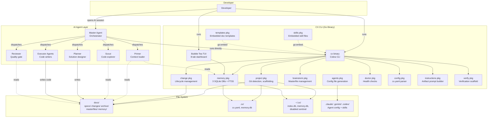

---

## CLI Command Tree

Every command starts with `project.IsGitRepo()` to find the project root via `git rev-parse --show-toplevel`. A `PersistentPreRun` hook blocks all commands (except `enable`, `disable`, `version`) when `~/.cx/disabled` exists.

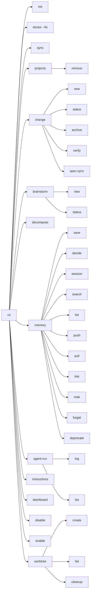

### Command Purposes

| Command | What It Does |
|---------|-------------|
| `cx init` | Bootstrap: scaffold `docs/`, `.cx/`, select agent integrations, install git hooks, write `.mcp.json` |
| `cx doctor [--fix]` | Validate project health across 7 check groups; `--fix` auto-repairs fixable issues |
| `cx sync` | Re-generate agent config files, skills, and MCP configs for all installed agents |
| `cx projects` / `remove` | List or remove projects from the global `~/.cx/index.db` registry |
| `cx change new/status/archive/verify/spec-sync` | Full change lifecycle management |
| `cx brainstorm new/status` | Create and list masterfiles for ideation |
| `cx decompose <name>` | Convert masterfile to change structure, archive masterfile |
| `cx memory save/decide/session/search/list/push/pull/link/note/forget/deprecate` | Full memory CRUD, search, and team sync |
| `cx agent-run log/list` | Track AI agent dispatches per session |
| `cx instructions <artifact>` | Generate prompt with template + project context + dependency graph for an artifact |
| `cx dashboard` | Launch the Bubble Tea TUI |
| `cx disable/enable` | Suspend/restore all agent configs (`disable` removes cx-managed files and restores pre-init snapshot; `enable` removes sentinel and runs full sync) |
| `cx worktree create <branch-name>` | Create a git worktree + branch under `.cx/worktrees/` for isolated task execution |
| `cx worktree list` | Show active worktrees: branch name, path, HEAD commit |
| `cx worktree cleanup <change-name>` | Remove all worktrees whose branch name is prefixed with `<change-name>` |

---

## Agent Hierarchy & Dispatch

The Master agent (defined in `CLAUDE.md`) is a pure orchestrator. It **never reads source code, never writes code, never analyzes code**. It classifies developer intent, dispatches specialized subagents, and enforces the change lifecycle.

### Agent Hierarchy

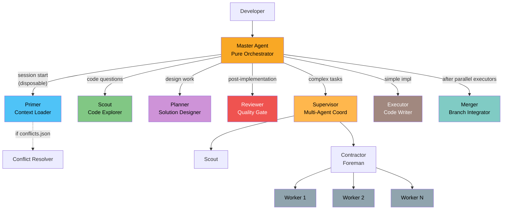

### Agent Capabilities Matrix

| Agent | Reads Code | Writes Code | Reads Memory | Writes Memory | Disposable |
|-------|-----------|-------------|-------------|--------------|------------|
| **Master** | Never | Never | Never directly | `cx memory session/decide/save`, `cx agent-run log` | No (always loaded) |
| **Primer** | Never | Never | `cx memory search/list` | Never | Yes |
| **Scout** | Yes (read-only) | Never | None | Never — returns findings to Master; Master saves non-trivial structural discoveries as observations | Yes |
| **Planner** | Never | Writes `docs/` only | Via Primer context | `cx memory decide` (architectural decisions), `cx memory save --type observation` (non-obvious constraints) | Yes |
| **Reviewer** | Yes (read-only) | Never | `cx memory search --change` | Never — returns findings to Master; Master saves recurring patterns or important lessons as observations | Yes |
| **Executor** | Yes | Yes | Receives primed context | `cx memory save --type observation --change <name>` (non-trivial implementation discoveries) | Yes |
| **Merger** | Yes | Yes (merges branches) | Receives context from Master | `cx memory save --type observation` (conflict patterns and resolution strategies) | Yes |
| **Workers** | Yes | Yes | Inline instructions only | None | Yes |

### CX Core Subagent Templates

CX ships **6 subagent template files** embedded in the binary and written to the agent config directory on `cx init` / `cx sync`:

| Template file | Agent role | Read/Write |
|---------------|-----------|------------|
| `cx-primer.md` | Context Loader — loads docs, specs, memory for session priming | Read-only |
| `cx-scout.md` | Code Explorer — maps codebases, traces code paths, answers structural questions | Read-only |
| `cx-planner.md` | Solution Designer — writes masterfiles and change docs (`docs/` only) | Writes `docs/` |
| `cx-reviewer.md` | Quality Gate — reviews code and docs for correctness, security, conventions | Read-only |
| `cx-executor.md` | Implementation Worker — writes code, runs tests, follows proposal/design/tasks | Writes code |
| `cx-merger.md` | Branch Integrator — merges executor worktree branches after parallel execution; resolves conflicts | Writes code |

`cx-executor.md` includes the context loading protocol, implementation rules, and explicit memory save instructions (`cx memory save --type observation --change <name>`). Project-specific executor agents (e.g., `go-expert`, `react-expert`) are defined separately by the developer and supplement the core executor.

### Dispatch Decision Flow

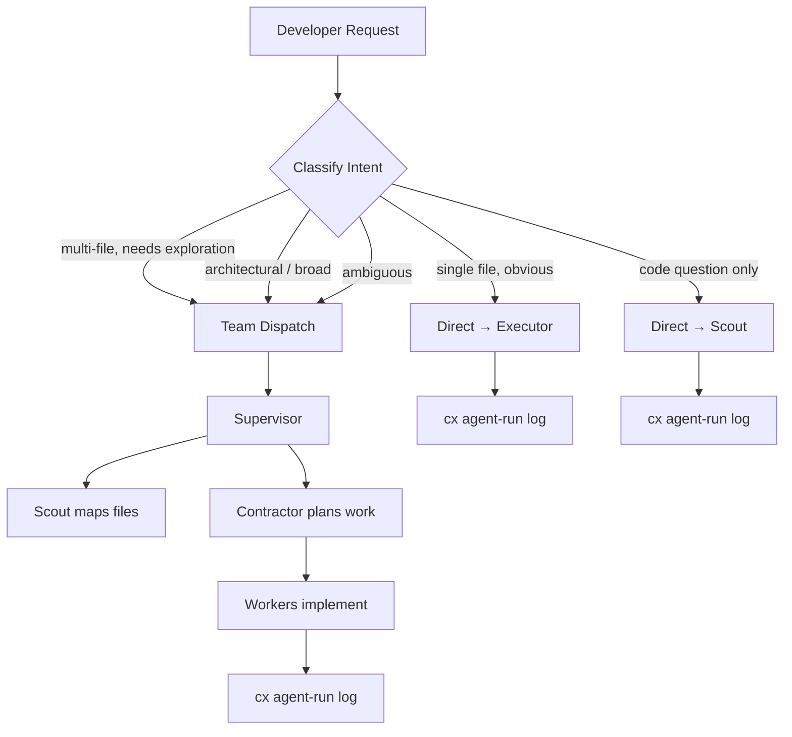

### Context Loading Protocol

Every subagent dispatch follows this loading order:

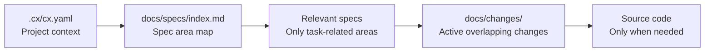

For executor dispatches, the Master also provides:
1. `proposal.md` and `design.md` from the change
2. The specific task description from `tasks.md`
3. Scout's file map of affected areas
4. Session ID for tracking

---

## Session Modes

The Master classifies every developer interaction into one of four modes. Each mode has different context loading, memory behavior, and workflow steps.

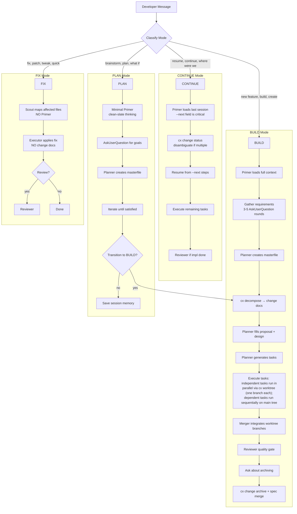

### Mode Context Comparison

| Aspect | BUILD | CONTINUE | PLAN | FIX |
|--------|-------|----------|------|-----|
| **Primer** | Full load | Session-focused | Minimal (clean slate) | Skipped entirely |
| **Memory loaded** | Decisions + observations (7d) + notes | Last session + change-scoped memory | Personal preferences only | Nothing |
| **Change docs** | Created fresh | Resumed | None until transition | Never created |
| **Token budget** | 500-800 tokens | 500-800 tokens | 300-500 tokens | 0 tokens |
| **Memory written** | Decisions, observations, session | Observations, session | Session (at transition) | `agent-run log` only |
| **Scope guard** | None | None | No implementation allowed | Redirect to BUILD if scope grows |

---

## Change Lifecycle

Changes are the **fundamental unit of work** in CX. Every piece of implementation is tracked as a change in `docs/changes/<name>/`.

### Change Directory Structure

```
docs/changes/<name>/
├── proposal.md      — Problem statement, goals, success criteria
├── design.md        — Technical approach, architecture decisions
├── tasks.md         — Ordered implementation tasks
├── verify.md        — Created by cx change verify (not by cx change new)
└── specs/
    └── <area>/
        └── spec.md  — Delta spec: ADDED / MODIFIED / REMOVED sections
```

### Lifecycle State Machine

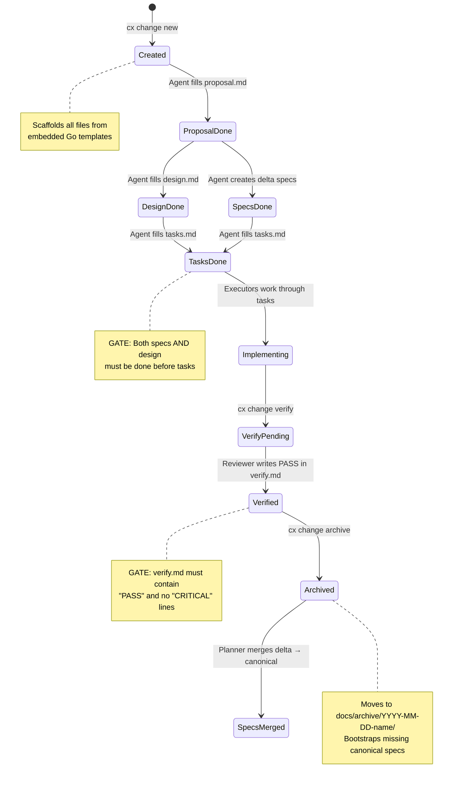

### Dependency Graph (Enforced by Master)

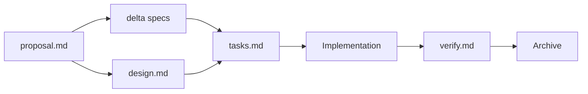

The Master agent enforces these gates: no step proceeds until its dependencies are complete. `cx change archive` programmatically validates file completeness by comparing content against templates (stripping frontmatter).

### Archive Validation

`cx change archive <name>` performs these checks:

1. `proposal.md`, `design.md`, `tasks.md` must all differ from their templates (not empty/unchanged)
2. `verify.md` must exist and contain the string `PASS`
3. `verify.md` must not contain any line starting with `CRITICAL`
4. Exception: `--skip-specs` bypasses the verify gate for non-behavioral changes

On successful archive:
- Files move to `docs/archive/YYYY-MM-DD-<name>/`
- For each unsynced delta spec where no canonical spec exists, `deltaToCanonical()` bootstraps one from the ADDED Requirements section
- Returns `ArchiveResult{ArchivePath, BootstrappedSpecs[], DeltaSpecs[]}`

---

## Memory System

### Three-Database Architecture

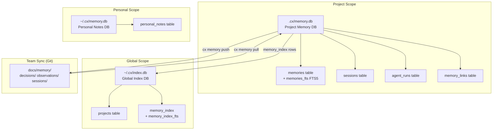

All databases use WAL mode and foreign keys. Schema migrations are version-tracked via a `schema_migrations` table and run idempotently on every open.

### Memory Entity Types

| Entity | Table | Stored In | Purpose |
|--------|-------|-----------|---------|
| **Observation** | `memories` | Project DB | Discoveries, patterns found during exploration |
| **Decision** | `memories` | Project DB | Technical decisions with context/rationale/alternatives |
| **Session** | `sessions` | Project DB | Session summaries with goal/accomplished/next |
| **Agent Interaction** | `memories` | Project DB | Logged via `cx agent-run log` |
| **Agent Run** | `agent_runs` | Project DB | Individual agent dispatch records linked to sessions |
| **Memory Link** | `memory_links` | Project DB | Relationships: `related-to`, `caused-by`, `resolved-by`, `see-also` |
| **Personal Note** | `personal_notes` | Personal DB | Developer notes that span projects, never synced |

### FTS5 Search Flow

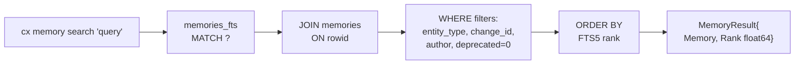

Cross-project search (`--all-projects`) opens each registered project's `.cx/memory.db` via the global index and federates results with project attribution.

### Push/Pull Team Sync

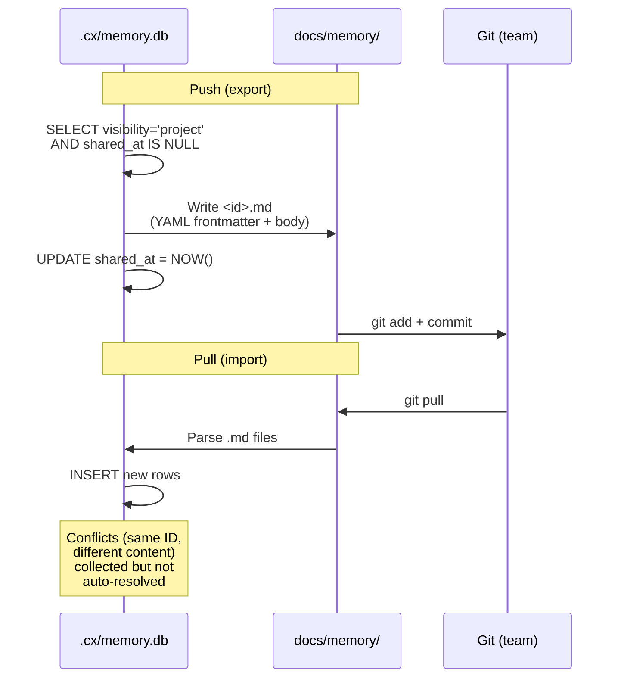

### Deprecation Chain

When `SaveMemory()` is called with `Deprecates != ""`:
1. Sets `deprecated=1` on the referenced memory
2. Removes it from the FTS index
3. If both are decisions: sets `status='superseded'` on the old one

### Memory Ownership Model

Each agent class has a defined and exclusive role in memory writes:

| Agent | Memory Responsibility |
|-------|-----------------------|
| **Master** | Saves session summaries (`cx memory session`), decisions (`cx memory decide`), and observations on behalf of read-only agents (`cx memory save`) |
| **Planner** | Saves architectural decisions (`cx memory decide`) and non-obvious constraints (`cx memory save --type observation`) during design work |
| **Executor** | Saves non-trivial implementation discoveries (`cx memory save --type observation --change <name>`) |
| **Scout** | Read-only — returns findings to Master; Master decides what to save |
| **Reviewer** | Read-only — returns findings to Master; Master decides what to save |
| **Primer** | Read-only — returns distilled context; no memory writes |

### Post-Dispatch Memory Protocol

After each subagent returns, the Master follows this protocol:

| Agent returned | Master action |
|---------------|---------------|
| **Scout** | Evaluate findings; save non-trivial structural discoveries as observations via `cx memory save` |
| **Reviewer** | Save recurring patterns or important lessons as observations via `cx memory save` |
| **Planner** | No Master action needed — Planner saves its own decisions and observations during design work |
| **Executor** | Review summary for anything missed; Executor already saves its own observations |

---

## Spec Management

Specs live in `docs/specs/` with an `index.md` serving as the authoritative catalog.

### Spec Architecture

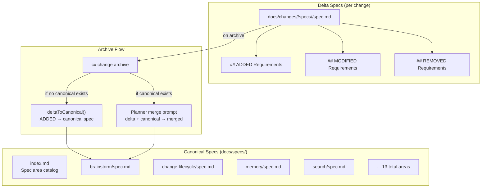

`cx change spec-sync <name>` generates a merge prompt (not automated) that assembles both the delta and canonical spec for an AI agent to produce the merged result. The `synced: true` flag is added to delta frontmatter after merge.

---

## Brainstorm & Masterfile Flow

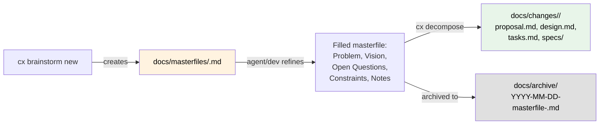

Masterfile names must be kebab-case, max 40 characters. The `fileModified()` function detects whether a masterfile has been filled by comparing content against the template (stripping frontmatter).

---

## Worktree-Based Parallel Execution

### The Problem

In BUILD mode, independent tasks can be executed in parallel to reduce wall-clock time. However, without isolation, executors write to the same working tree and risk file-level conflicts, partial-state corruption, and interleaved test failures that are difficult to attribute to a single task.

### The Solution

Each independent task gets its own git worktree under `.cx/worktrees/`. Every executor operates on a dedicated branch in its own directory, with no shared file-system state during execution. When all parallel executors complete, a Merger agent integrates the branches back into the main tree and resolves any conflicts. A single cleanup command removes all worktrees created for a given change.

### Execution Flow

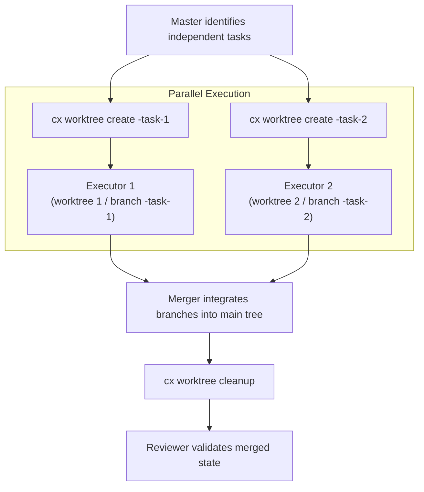

### CLI Commands

| Command | What It Does |
|---------|-------------|
| `cx worktree create <branch-name>` | Creates a git worktree + branch under `.cx/worktrees/<branch-name>`; the branch is created off the current HEAD |
| `cx worktree list` | Lists all active worktrees: branch name, filesystem path, and HEAD commit |
| `cx worktree cleanup <change-name>` | Removes all worktrees and branches whose names are prefixed with `<change-name>` |

### Execution Paths

| Scenario | Strategy |
|----------|----------|
| **2 or more independent tasks** | Worktree-based parallel execution (default) |
| **Dependent tasks only** | Sequential execution on the main working tree (fallback) |
| **Mixed dependency graph** | Parallel groups execute via worktrees; each group's result is merged before the next dependent group begins |

The Master determines task independence from the dependency graph in `tasks.md`. A task is independent if it has no predecessor tasks that are not yet complete.

---

## Skills System

Skills are the workflow definitions that tell the Master agent how to handle each session mode. There are **16 skills** embedded in the Go binary via `//go:embed`.

### Skill Format

```markdown
# Skill: cx-<name>
## Description    — what & when
## Triggers       — activation patterns
## Steps          — numbered workflow
## Rules          — constraints & guardrails
```

### Skill Lifecycle

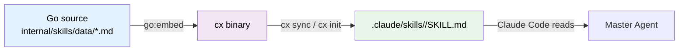

Skills are **not user-editable** on disk. `cx sync` always overwrites them. Customization goes in `CLAUDE.md`, not skill files.

### All 16 Skills

| Skill | Mode | Purpose | Key Behavior |
|-------|------|---------|-------------|
| `cx-build` | BUILD | Full new feature lifecycle | Requirements → plan → decompose → implement → review → archive |
| `cx-continue` | CONTINUE | Resume existing work | Loads last session's `--next` field; picks up where left off |
| `cx-plan` | PLAN | High-level brainstorming | Clean-slate thinking; no implementation; creates masterfiles |
| `cx-fix` | FIX | Quick localized changes | Bypasses entire change lifecycle; Scout → Executor → optional Review |
| `cx-brainstorm` | - | Masterfile creation | Free-form ideation; decomposes to change when ready |
| `cx-change` | - | Change CRUD & lifecycle | `cx instructions` before every artifact; enforces dependency graph |
| `cx-review` | - | Code/doc quality gate | Read-only; structured pass/fail report; blocks archive on CRITICAL |
| `cx-scout` | - | Codebase exploration | Read-only; returns findings to Master; Master evaluates and saves non-trivial discoveries as observations |
| `cx-prime` | - | Session context loading | Disposable; loads mode-specific memory; 500-800 token output |
| `cx-memory` | - | Memory CRUD & sync | Push/pull team sync; `--next` is critical session bridge |
| `cx-supervise` | - | Multi-agent coordination | Task distribution; progress tracking; result aggregation |
| `cx-refine` | - | Iterative doc improvement | Review cycles until satisfied |
| `cx-contract` | - | API contract management | Backward compat checks; also serves as Contractor (foreman) |
| `cx-conflict-resolve` | - | Memory conflict resolution | Spawned by Primer (not Master); requires developer input |
| `cx-doctor` | - | Project health checks | 7 check groups; `--fix` with developer approval |
| `cx-linear` | - | Linear issue tracking | Requires Linear MCP server |

### Skill Interaction Map

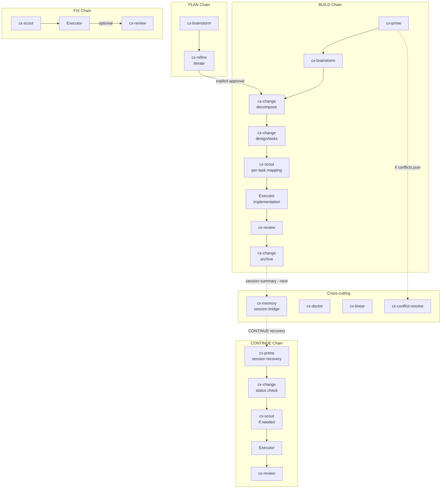

---

## TUI Dashboard

The TUI is a Bubble Tea application with 8 tabs, polling data every 5 seconds from all three SQLite databases.

### TUI Architecture

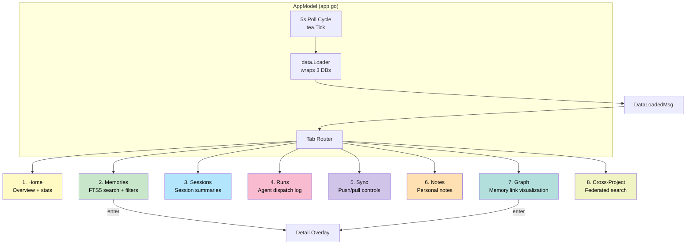

### Layout

- **Wide mode** (>= 100 columns): two-pane layout (list + preview)
- **Narrow mode** (< 100 columns): single-pane
- Tab bar (1 row) + content area + status bar (1 row)
- Theming: auto-detects terminal background → Catppuccin Mocha (dark) or Latte (light)

### Key Interactions

| Key | Action |
|-----|--------|
| `tab` / `shift+tab` | Navigate between tabs |
| `j` / `k` or arrows | Navigate list items |
| `enter` | Open detail overlay or navigate to linked memory |
| `/` | Start FTS5 search (Memories tab) |
| `d` | Deprecate a memory |
| `p` / `l` | Push / Pull (Sync tab) |
| `q` / `ctrl+c` | Quit |

---

## Internal Package Map

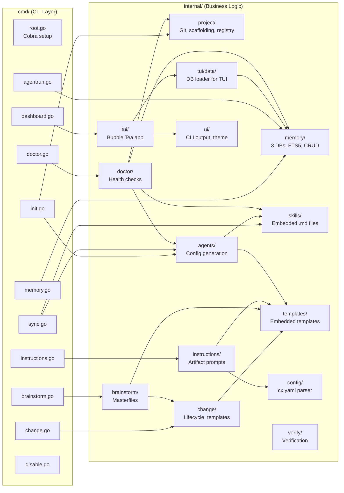

---

## Build & Distribution

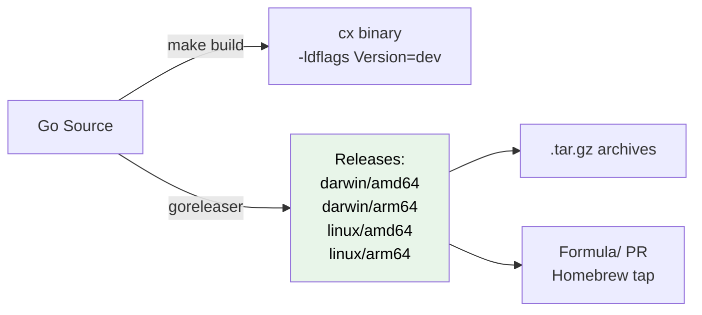

- **Module**: `github.com/AngelMaldonado/cx`
- **Go version**: 1.25
- **Key deps**: Cobra (CLI), Bubble Tea + Lip Gloss + Glamour (TUI), modernc SQLite (pure Go, no CGO)
- **Version injection**: `cmd.Version` set via `-ldflags` at build time
- **All file writes**: atomic via `.tmp` → `os.Rename()` pattern

---

## Key Design Decisions

### 1. Master Never Touches Code
The Master agent's context window is always loaded — it persists the entire conversation. Every token it consumes survives. By delegating all code reading/writing to disposable subagents, the Master stays lean and avoids context compaction.

### 2. `docs/` is the Source of Truth, SQLite is Cache
All canonical data lives in markdown files committed to git. SQLite databases are local query caches that can be rebuilt from markdown via `cx memory pull` and `RebuildFromMarkdown()`. This means team sync happens through git, not a separate sync protocol.

### 3. FIX Mode is an Intentional Bypass
FIX mode deliberately skips Primer, Planner, memory writes, and change docs. A scope guard redirects to BUILD if the fix grows beyond a single-file localized change. This prevents FIX from becoming an untracked refactor path.

### 4. The `--next` Field is the Only Session Bridge
The `next` field in `cx memory session` summaries is how CONTINUE mode recovers state across sessions. Without it, the next session has no bridge to prior work. Both `cx-continue` and `cx-memory` skills call this out as critical.

### 5. Skills are Compiled, Not Editable
Skill files are embedded in the Go binary via `//go:embed` and written to disk by `cx sync`. They are always overwritten on upgrade. Developer customization goes in `CLAUDE.md`, not skill files.

### 6. Conflict Resolution Happens During Priming
The Conflict Resolver is spawned by Primer (not Master) when `.cx/conflicts.json` exists. This means conflicts are surfaced during context loading, before the Master classifies the session mode.

### 7. Atomic Writes Everywhere
All file writes in the codebase use a `.tmp` → `os.Rename()` pattern to prevent partial writes. This is especially important for SQLite-adjacent markdown files that represent canonical state.

### 8. Disable/Enable as Safety Valve

The disable/enable mechanism preserves the user's original agent configuration across the cx lifecycle:

- **`cx init`**: before writing any agent files, snapshots the user's pre-existing agent directories (`.claude/`, `.gemini/`, `.codex/`) to `~/.cx/agent-backups/<project-id>/pre-init/`. Only the first init captures this baseline; subsequent inits do not overwrite it.
- **`cx disable`**: removes all cx-managed files (config file, skill directories, subagent files) via `RemoveCXManagedFiles()`, then restores the pre-init snapshot if one exists. This leaves the user in their original pre-cx state. Creates a `~/.cx/disabled` sentinel.
- **`cx enable`**: removes the sentinel, then runs a full sync (equivalent to `cx sync`) — calls `WriteConfigFile` + `WriteSkills` + `WriteSubagents` for each detected agent. No backup-restore involved.

All commands check the sentinel in `PersistentPreRun` and refuse to run while disabled (except `enable`, `disable`, `version`).
